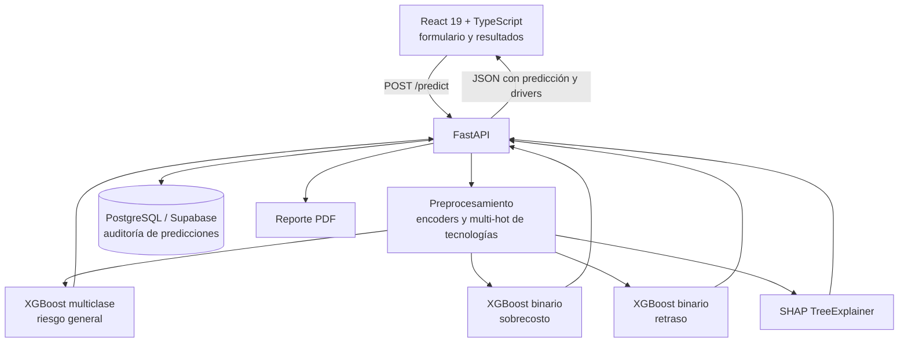

# RiskPredictor — Estimación de riesgo en proyectos de TI con explicabilidad

[](https://github.com/martinzapanaberrospi/RiskPredictor-RPA/actions/workflows/ci.yml)
[](https://fastapi.tiangolo.com)
[](https://xgboost.readthedocs.io/)
[](https://shap.readthedocs.io/)
[](https://react.dev)
[](https://www.docker.com)
[](LICENSE)

Aplicación de aprendizaje automático que estima, a partir de los parámetros iniciales de un proyecto de TI, la probabilidad de **sobrecosto**, de **retraso** y un **nivel de riesgo general**, y explica cada predicción con SHAP. Incluye API en FastAPI, frontend en React y pruebas automatizadas.

> **Alcance del proyecto.** Es un proyecto personal de aprendizaje, hecho en el marco de un curso. **Los datos son sintéticos**: se generan con un proceso propio (`data/generate_synthetic_data.py`) y no provienen de proyectos reales. Las métricas de abajo miden qué tan bien el modelo recupera las relaciones que ese generador introduce; **no son evidencia de desempeño sobre proyectos reales**. El sufijo `RPA` del nombre es histórico: el proyecto no automatiza tareas de escritorio, es un modelo predictivo con API.

---

## El problema

Antes de aprobar un proyecto de TI, quien decide tiene pocos datos duros: tipo de proyecto, metodología, duración y presupuesto estimados, tamaño y experiencia del equipo, tecnologías involucradas y número de hitos. La pregunta es si con eso se puede anticipar que el proyecto se desviará, y sobre todo **qué factores pesan** en esa estimación, porque una predicción sin explicación no cambia ninguna decisión.

De ahí las tres salidas del modelo y la explicabilidad con SHAP: no basta con decir "riesgo alto", hay que decir que pesa la complejidad alta con un equipo de poca experiencia.

---

## El hallazgo más importante del proyecto

La primera versión del modelo **no superaba al azar** para predecir sobrecosto: ROC-AUC de **0.486** en el conjunto de prueba (0.5 es lanzar una moneda).

Al revisar el generador de datos encontré la causa. La etiqueta se construía así:

```python
# La desviación de costo se sorteaba con media 1.0 para TODOS los proyectos;
# solo cambiaba la varianza según complejidad y experiencia.
desviacion_costo = np.random.normal(1.0, 0.08 + ...)
costo_real = int(presupuesto * desviacion_costo)
sobrecosto = (costo_real > presupuesto_estimado)
```

Con media 1.0 para todos, la probabilidad de sobrecosto era ~50% en cualquier proyecto, **independiente de sus características**. No había nada que aprender: el modelo no estaba mal entrenado, la etiqueta no tenía relación con las variables de entrada.

La corrección fue rediseñar el proceso generador para que la desviación **esperada** dependa de factores observables (complejidad, experiencia del equipo, presupuesto por recurso, número de tecnologías, metodología y holgura del cronograma), conservando el ruido aleatorio encima. Con el mismo pipeline de entrenamiento:

| Objetivo | ROC-AUC antes | ROC-AUC después | F1 antes | F1 después |
|---|---|---|---|---|
| Sobrecosto | 0.486 | **0.689** | 0.473 | **0.764** |
| Retraso | 0.660 | **0.800** | 0.130 | **0.598** |
| Riesgo general (3 clases) | 0.681 | **0.704** | 0.541 | 0.527 |

La lección que me llevo: antes de tocar hiperparámetros, hay que verificar que la etiqueta tenga señal respecto de las variables disponibles.

---

## Resultados actuales

Medidos sobre el 20% de prueba, que nunca se balancea ni se toca durante el entrenamiento ([`models/metrics.json`](models/metrics.json)):

| Modelo | Tipo | ROC-AUC | F1 | Lectura honesta |
|---|---|---|---|---|
| Sobrecosto | Binario | 0.689 | 0.764 | Discrimina, pero lejos de ser determinante |
| Retraso | Binario | 0.800 | 0.598 | El mejor de los tres; el plazo depende más de factores observables |
| Riesgo general | Multiclase (Alto/Medio/Bajo) | 0.704 | 0.527 | La clase "Alto" es minoritaria y sigue siendo la más difícil |

Factores más influyentes según SHAP: **complejidad**, **experiencia del equipo**, **presupuesto estimado**, **número de recursos** y **metodología**. Son los mismos que el generador introduce como drivers, que es justo lo que se espera comprobar.

---

## Metodología

- **Partición estratificada 80/20 antes de cualquier transformación.** El balanceo por upsampling se aplica **solo** al conjunto de entrenamiento; el de prueba conserva la distribución original. Balancear antes de partir duplicaría registros a ambos lados y daría métricas infladas.
- **Validación cruzada estratificada de 5 folds** con `GridSearchCV` optimizando `f1_weighted`.
- **Explicabilidad con SHAP TreeExplainer**, cuyos valores se sirven junto a cada predicción.
- **La brecha entre validación cruzada y prueba se reporta tal cual.** En riesgo general el F1 de CV (sobre datos balanceados) es más alto que el de prueba: es el efecto esperado del upsampling y no se maquilla.

---

## Arquitectura



---

## Estructura del repositorio

```
RiskPredictor-RPA/
├── data/
│   ├── generate_synthetic_data.py  # Proceso generador de los datos sintéticos
│   ├── preparacion.py              # Construye dataset.csv
│   └── opciones_formulario.json    # Catálogos del formulario
├── models/
│   ├── train_xgboost.py            # Entrenamiento, tuning, evaluación y SHAP
│   ├── metrics.json                # Métricas de la última corrida
│   └── *.pkl                       # Modelos, encoders y explainer
├── api/main.py                     # API FastAPI
├── frontend/                       # SPA en React 19 + TypeScript
├── utils/                          # Envío de correo y generación de PDF
├── tests/                          # Pruebas de API y de predicción
├── Dockerfile / docker-compose.yml
└── .github/workflows/ci.yml        # Pruebas de Python y build del frontend
```

---

## Cómo ejecutarlo

Requisitos: Python 3.11 o superior y Node.js 18 o superior.

```bash
git clone https://github.com/MartinZapanaBerrospi/RiskPredictor-RPA.git
cd RiskPredictor-RPA
pip install -r requirements.txt
```

```bash
python data/generate_synthetic_data.py   # 1. genera los datos sintéticos
python data/preparacion.py               # 2. arma dataset.csv
python models/train_xgboost.py           # 3. entrena, evalúa y guarda artefactos
pytest tests/ -q                         # 4. pruebas de API y predicción
uvicorn api.main:app --reload            # 5. API en http://localhost:8000/docs
```

Frontend:

```bash
cd frontend
npm install
npm run dev
```

Con Docker: `docker compose up --build`. Copia `.env.example` a `.env` y completa `DATABASE_URL` si quieres persistir el historial de predicciones.

---

## Limitaciones conocidas

- **Los datos son sintéticos y el generador es mío.** El modelo aprende las relaciones que yo introduje: las métricas miden esa recuperación, no capacidad predictiva sobre proyectos reales. Con datos reales habría que reentrenar y volver a evaluar desde cero.
- **El desempeño es moderado a propósito.** El generador incluye ruido irreducible; un AUC cercano a 1 sería señal de fuga de datos, no de un buen modelo.
- **La clase "Alto" está desbalanceada** y es la que peor se predice, incluso con upsampling en entrenamiento.
- **Sin monitoreo de deriva.** La tabla de auditoría guarda las predicciones, pero no hay reentrenamiento ni alertas automáticas.
- **El nombre incluye `RPA` por razones históricas** y no corresponde al contenido; el proyecto es de modelado predictivo.

---

## Autor

**Martín Zapana Berrospi** — Estudiante de Ingeniería de Sistemas (9no ciclo) y Bachiller en Ciencias con mención en Matemática, Universidad Nacional de Ingeniería (UNI).

[Portafolio](https://www.martinzapana.com) · [LinkedIn](https://www.linkedin.com/in/martin-eduardo-zapana-berrospi/) · [GitHub](https://github.com/MartinZapanaBerrospi)
