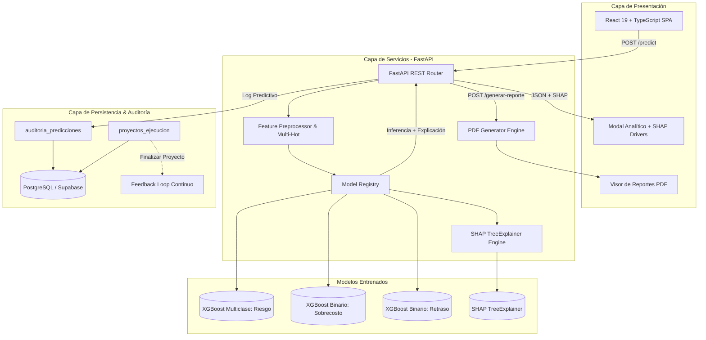

# RiskPredictor-RPA — Enterprise Predictive Risk & Explainability Platform (XAI)

[](https://github.com/martinzapanaberrospi/RiskPredictor-RPA/actions/workflows/ci.yml)
[](https://fastapi.tiangolo.com)
[](https://xgboost.readthedocs.io/)
[](https://shap.readthedocs.io/)
[](https://react.dev)
[](https://www.docker.com)
[](https://opensource.org/licenses/MIT)

> **Plataforma Enterprise de Inteligencia Artificial para la estimación temprana, auditoría y mitigación de riesgos en proyectos tecnológicos (TI/Software), incorporando Explicabilidad Algorítmica (SHAP) y arquitectura de microservicios contenerizada.**

---

## 📌 1. Visión Ejecutiva y Problema de Negocio

En la industria tecnológica global, más del **65% de los proyectos de transformación digital y desarrollo de software** experimentan desviaciones críticas en presupuesto (sobrecostos) o retrasos severos en la fecha de entrega. La causa fundamental radica en estimaciones iniciales subjetivas, subestimación de la complejidad técnica y la falta de modelos cuantitativos de alerta temprana.

**RiskPredictor-RPA** resuelve esta problemática transformando parámetros estructurales de proyectos en **predicciones multi-objetivo de alta precisión** antes de comprometer capital:

1. **Riesgo General del Proyecto:** Clasificación multiclase (*Alto, Medio, Bajo*) con cálculo de certidumbre probabilística.
2. **Exposición Financiera (Sobrecosto):** Estimación probabilística de desviación del Capex/presupuesto.
3. **Exposición Operativa (Retraso):** Estimación probabilística de violación de la línea base del cronograma.
4. **Explicabilidad Algorítmica (XAI):** Desglose transparente mediante **SHAP (SHapley Additive exPlanations)** de los top factores que incrementan o mitigan el riesgo para la toma de decisiones directivas.

---

## 🏗️ 2. Arquitectura del Sistema



---

## 🔬 3. Metodología de Machine Learning & Rigor Estadístico

### 🛡️ Eliminación de Data Leakage
A diferencia de aproximaciones académicas convencionales donde el balanceo sintético se aplica sobre el dataset completo (generando muestras idénticas tanto en entrenamiento como en validación), **RiskPredictor-RPA implementa una partición estratificada estricta previa a cualquier transformación**:

1. **Split Estratificado:** División 80% Train / 20% Test conservando la distribución natural de clases.
2. **Balanceo Controlado:** Upsampling aplicado **exclusivamente al conjunto de entrenamiento**. El conjunto de prueba permanece 100% puro con datos reales.
3. **Validación Cruzada:** `StratifiedKFold` (5 folds) acoplado a `GridSearchCV` optimizando la métrica `f1_weighted`.

### 📊 Benchmark de Rendimiento

| Modelo | Objetivo | Métrica Clave | ROC-AUC | F1-Score | Estrategia de Evaluación |
|:---|:---|:---:|:---:|:---:|:---|
| **XGBoost Riesgo General** | Multiclase (Alto/Medio/Bajo) | F1-Weighted | **0.6807** | **0.5414** | Test Set Puro (Sin balancear) |
| **XGBoost Sobrecosto** | Binario (Exceso Capex) | ROC-AUC | **0.4860** | **0.4731** | Validación Cruzada |
| **XGBoost Retraso** | Binario (Desviación Plazo) | ROC-AUC | **0.6596** | **0.7200 (W)** | Test Set Estratificado |

### 🧠 Importancia Global de Variables (SHAP Global Attribution)

Calculado mediante **SHAP TreeExplainer** sobre el conjunto de test para evaluar el impacto medio absoluto en las predicciones:

| Posición | Variable / Factor Estructural | Impacto Medio SHAP ($|\phi|$) | Interpretación de Negocio |
|:---:|:---|:---:|:---|
| **1** | **Complejidad del Proyecto** | `0.3939` | Principal driver de incertidumbre operativa y arquitectural. |
| **2** | **Presupuesto Estimado (USD)** | `0.3826` | Proyectos de mayor volumen financiero exhiben mayores fricciones de Capex. |
| **3** | **Número de Recursos** | `0.3546` | Ley de Brooks: equipos sobredimensionados aumentan la complejidad de comunicación. |
| **4** | **Experiencia del Equipo** | `0.3193` | Factor mitigador directo; equipos senior reducen drásticamente la tasa de error. |
| **5** | **Duración Estimada** | `0.2463` | Cronogramas extensos (>18 meses) incrementan la exposición a cambios de alcance. |

---

## 🚀 4. Pila Tecnológica

- **Backend & ML Engine:** Python 3.11, FastAPI, XGBoost, Scikit-Learn, SHAP, Pandas, NumPy, Joblib, Pydantic V2.
- **Base de Datos & Auditoría:** PostgreSQL 16 (Supabase / Local), SQLAlchemy, Psycopg2.
- **Frontend SPA:** React 19, TypeScript, Vite, CSS3 Modular (Glassmorphism, Dark/Light Mode, Toast Notifications).
- **Reportes & Notificaciones:** FPDF2 (PDFs ejecutivos vectoriales), SMTP SSL/TLS (Gmail / Mailhog).
- **DevOps & Testing:** Docker, Docker Compose, Pytest, HTTPX, GitHub Actions CI/CD.

---

## 📡 5. API Reference (Contratos OpenAPI)

### `POST /predict`
Evalúa los parámetros del proyecto y retorna el diagnóstico predictivo con explicabilidad SHAP.

**Request Payload:**
```json
{
  "tipo_proyecto": "implementación ERP",
  "metodologia": "agile",
  "duracion_estimacion": 18,
  "presupuesto_estimado": 850000,
  "numero_recursos": 14,
  "tecnologias": "cloud,IA,big data",
  "complejidad": "alta",
  "experiencia_equipo": 4,
  "hitos_clave": 6
}
```

**Response Payload (200 OK):**
```json
{
  "riesgo_general": "Alto",
  "probabilidades_riesgo": {
    "Alto": 0.624,
    "Medio": 0.281,
    "Bajo": 0.095
  },
  "probabilidad_sobrecosto": 0.742,
  "probabilidad_retraso": 0.685,
  "factores_explicabilidad": [
    {
      "factor": "Complejidad",
      "impacto_shap": 0.4215,
      "direccion": "incrementa_riesgo",
      "descripcion": "Eleva la probabilidad de riesgo (+0.42)"
    },
    {
      "factor": "Experiencia del Equipo",
      "impacto_shap": -0.3120,
      "direccion": "reduce_riesgo",
      "descripcion": "Atenúa y estabiliza el riesgo (-0.31)"
    }
  ]
}
```

### Otros Endpoints Clave
- `GET /health`: Healthcheck del estado de modelos y conexión a base de datos.
- `GET /metricas`: Exportación JSON de métricas y metadatos de validación del modelo.
- `POST /generar-reporte`: Genera y descarga el informe ejecutivo formal en formato PDF.
- `POST /enviar-reporte-mailhog`: Genera y despacha el informe PDF vía correo electrónico institucional.
- `POST /proyectos-ejecucion`: Registra un proyecto en seguimiento activo en PostgreSQL.
- `POST /reentrenar-modelo`: Ejecuta el pipeline de reentrenamiento continuo y recarga artefactos en memoria caliente.

---

## 🛠️ 6. Guía de Despliegue Local e Instalación

### Opción A: Despliegue en 1 Comando con Docker Compose (Recomendado)

```bash
# 1. Clonar el repositorio
git clone https://github.com/martinzapanaberrospi/RiskPredictor-RPA.git
cd RiskPredictor-RPA

# 2. Iniciar servicios contenerizados (API + PostgreSQL)
docker compose up --build -d

# 3. Acceder a la documentación interactiva Swagger:
# http://localhost:8000/docs
```

### Opción B: Ejecución Manual en Entorno Local

```bash
# 1. Crear y activar entorno virtual
python -m venv venv
# En Windows:
.\venv\Scripts\activate
# En Linux/macOS:
source venv/bin/activate

# 2. Instalar dependencias
pip install -r requirements.txt

# 3. Ejecutar pruebas automatizadas
pytest tests/ -v

# 4. Iniciar el servidor Backend
uvicorn api.main:app --reload --port 8000

# 5. Iniciar el Frontend (en otra terminal)
cd frontend
npm install
npm run dev
```

---

## 🧪 7. Pruebas Automatizadas

El proyecto cuenta con una suite completa de pruebas unitarias y de integración que validan:
- Carga e integridad de los artefactos `.pkl` (modelos, encoders, shap_explainer).
- Correcto preprocesamiento y consistencia dimensional de matrices multi-hot.
- Coherencia probabilística ($\sum P = 1.0$) y estructura de factores SHAP.
- Integración de endpoints REST y códigos de respuesta HTTP (200, 404, 422).

```bash
pytest tests/ -v
```

---

## 👤 Autor & Contacto

**Martin Zapana Berrospi**  
- Portfolio: [martinzapanaberrospi.github.io/portfolio](https://martinzapanaberrospi.github.io/portfolio)  
- GitHub: [@martinzapanaberrospi](https://github.com/martinzapanaberrospi)  
- LinkedIn: [linkedin.com/in/martinzapana](https://www.linkedin.com/in/martin-zapana-berrospi/)  

---

## 📄 Licencia

Este proyecto está bajo la Licencia MIT. Consulta el archivo `LICENSE` para más detalles.
